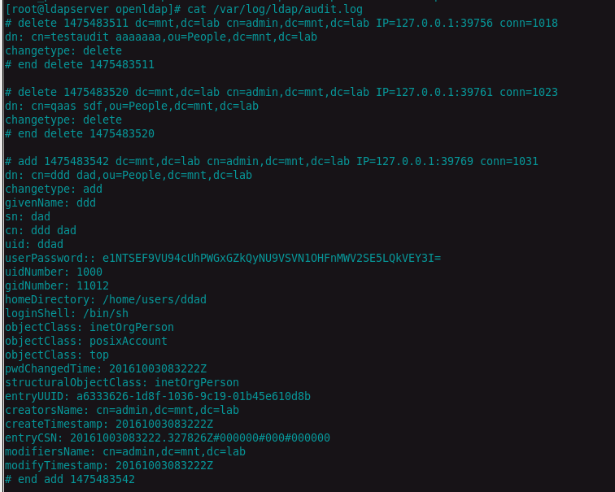
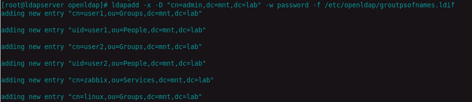
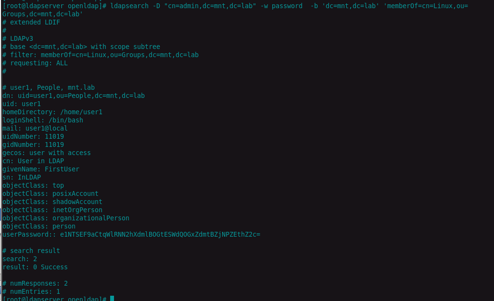
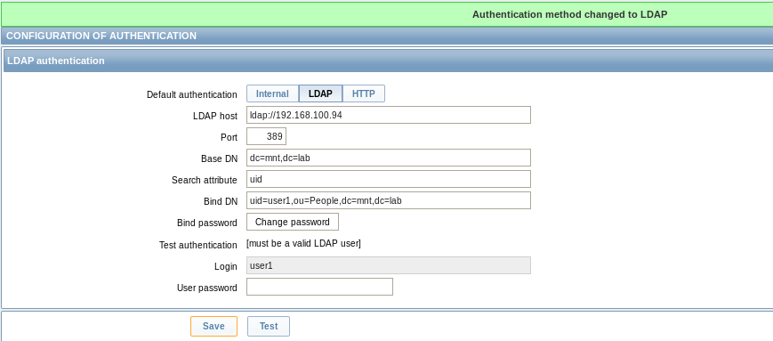
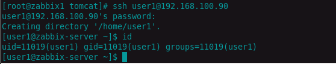
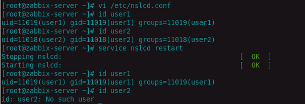

# zabbix

###1. Configure Audit logging



2. Configure Password Policy

```
dn: ou=policies,dc=mnt,dc=lab
ou: policies
objectClass: organizationalUnit
objectClass: top

# default, policies, example.com
dn: cn=default,ou=policies,dc=mnt,dc=lab
objectClass: top
objectClass: pwdPolicy
objectClass: person
cn: default
sn: dummy value
pwdAttribute: userPassword
pwdMaxAge: 7516800
pwdExpireWarning: 14482463
pwdMinLength: 2
pwdMaxFailure: 10
pwdLockout: TRUE
pwdLockoutDuration: 60
pwdMustChange: FALSE
pwdAllowUserChange: TRUE
pwdSafeModify: FALSE

```
run it with command:
```
ldapadd -x -D "cn=admin,dc=mnt,dc=lab" -w password -f /etc/openldap/passwordpol.ldif
```

3. Create groupOfNames Linux and Zabbix. Add users into these groups.
[link to ldif](groutpsofnames.ldif)
  
 	

check, that ldapsearch has possibility to access memberof value:



change type of authentification for zabbix



##configuring ldap client

    


add following content to /etc/nslcd.conf 

```
filter passwd (&(objectClass=posixAccount)(memberOf=cn=linux,ou=Groups,dc=mnt,dc=lab))

```


    
 	
    

