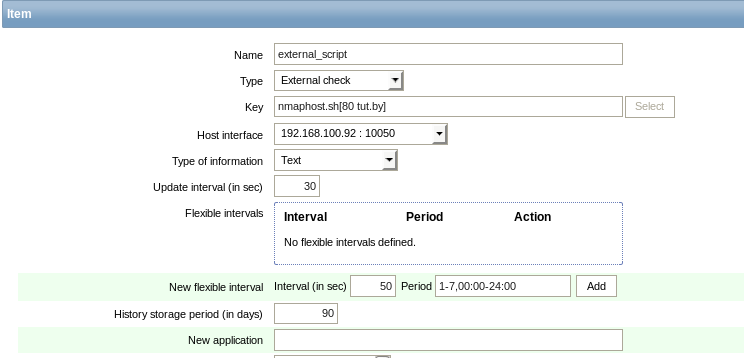
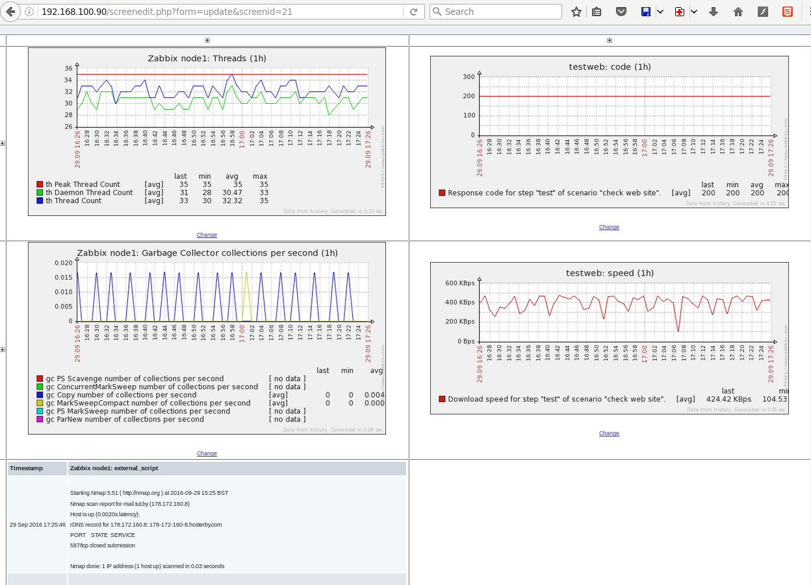

# zabbix task3
1. Make UserParameter in the agent config, make corresponding counter in host config on server and receive that parameter. 


2. Make ExternalCheck on server, and then make script for that check. Receive data from script.

simple script is
```
nmap -p$1 $2 # e.g nmap -p587 mail.sviat.by
```


changed external check with parameters



3. Setup web monitoring for any external web site.


4. Install Tomcat 7 and examine JMX parameters with JMX Gateway. (as example java.lang:type=Memory,HeapMemoryUsage.used etc.)
5. Enable Template Template JMX Tomcat


6. All custom checks create in Template


7. Make graphics for collected counters.


8. Make summary screen with previously configured graphics.

